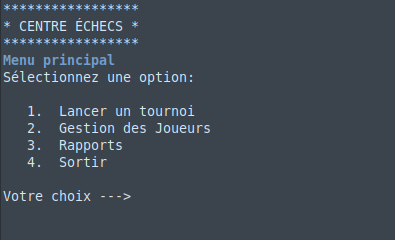
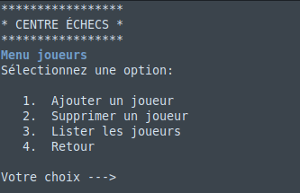
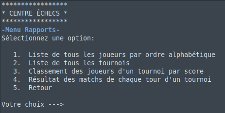
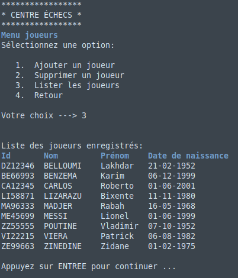
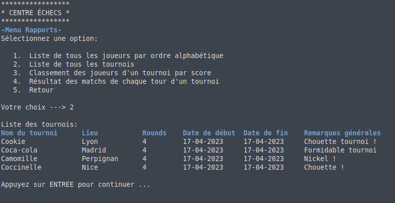

# DA-Python - Projet 4

### Description du projet

Logiciel de gestion de tournois et de joueurs d'échecs.
Ce programme permet de lancer des tournois et de stocker les informations concernant les joueurs, les tournois, les rounds et les matchs.
Un menu "Rapports" permet de consulter ces informations.
Enfin, un menu "Gestion des Joueurs" permet l'ajout ou la suppression de joueurs en base.

### Récupération du projet
```
git clone https://github.com/bengomar/DA_Python_Projet_4.git
```

### Création d'un environment virtuel
```
cd DA_Python_Projet_4
python -m venv env
source env/bin/activate
```

### Installation des dépendances du projet
```pip install -r requirements.txt```

### Execution du programme :
    
```python run.py```

### Générer un rapport flake8
    
```flake8 --format=html --htmldir=flake8_report```

### Présentation visuelle du logiciel

#### Exemples de menu:







#### Exemples d'affichage:



